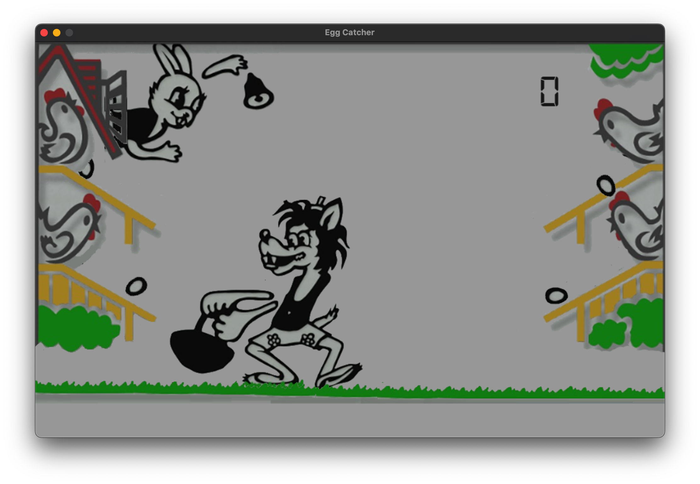
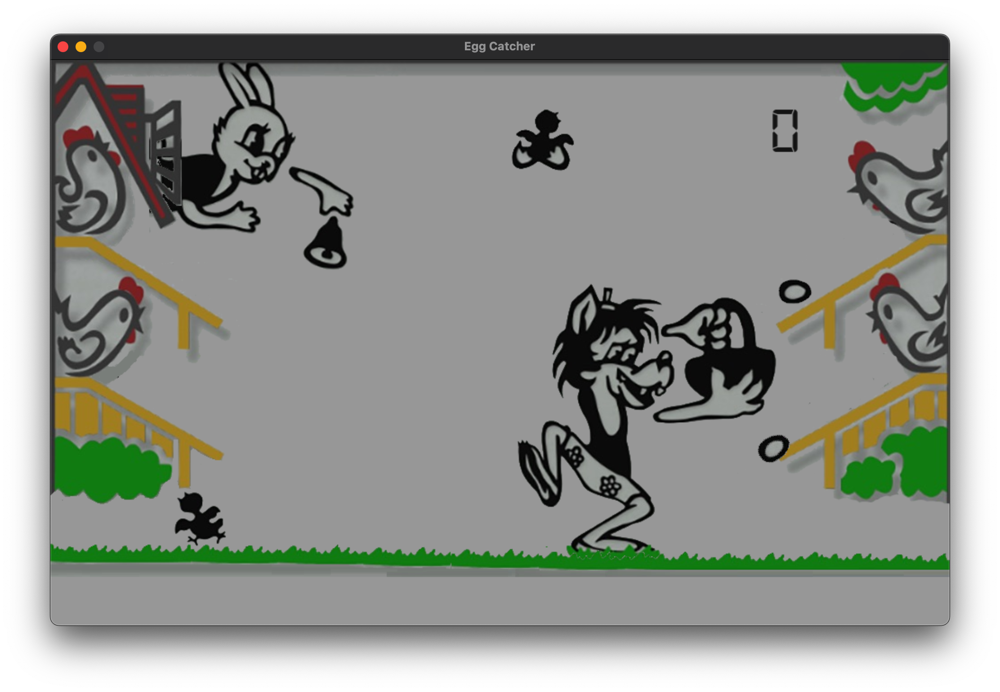

# Ну, Погоди!

«Ну, погоди!» («Электроника ИМ-02») — электронная игра, самая известная и популярная из серии первых советских портативных электронных игр с жидкокристаллическим экраном, производимых под торговой маркой «Электроника». Производилась с 1984 года. Кроме игры, устройство обладает функцией часов и будильника. Розничная цена составляла 25 рублей (позднее — 23 рубля).
Первоначально не имела категорийного номера. Впоследствии получила номер «Электроника ИМ-02». Аббревиатура «ИМ» означает «игра микропроцессорная».
Микропроцессор: КБ1013ВК1-2, дисплей ИЖМ2-71-01 (в первых выпусках) или ИЖМ13-71.

## Установка

```bash
pip install -r requirements.txt
```

## Запуск

```bash
python game.py
```

## Управление

* **A** — влево
* **D** — вправо
* **W** — вверх
* **S** — вниз
* **1** - Включить/выключить звук
* **ENTER** - перезапуск

## Скриншоты


